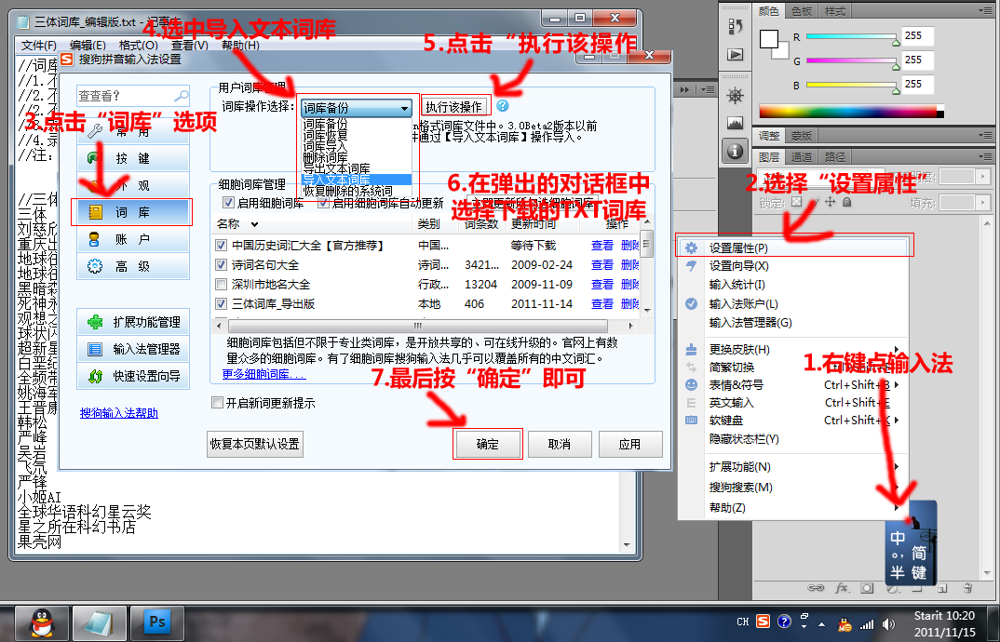

# 三体词库
这是我以前做的三体词库，将词库导入输入法后即可输出三体中的常见词汇。同时词库中还包含和三体相关的一些科幻名词。

#使用方法说明
将导入版的词库导入到输入法里
也可以直接从官网上下

#官网下载链接
##搜狗输入法：
  http://pinyin.sogou.com/dict/detail/index/28415
##QQ拼音输入法
  http://dict.py.qq.com/cgi-bin/show_detail?ID=25784

